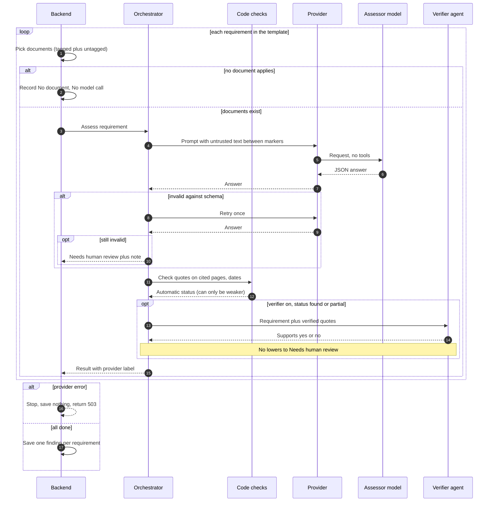

```mermaid
sequenceDiagram
    autonumber
    participant API as Backend
    participant Orch as Orchestrator
    participant Chk as Code checks
    participant Prov as Provider
    participant LLM as Assessor model
    participant Ver as Verifier agent
    loop each requirement in the template
        API->>API: Pick documents (tagged plus untagged)
        alt no document applies
            API->>API: Record No document, No model call
        else documents exist
            API->>Orch: Assess requirement
            Orch->>Prov: Prompt with untrusted text between markers
            Prov->>LLM: Request, no tools
            LLM-->>Prov: JSON answer
            Prov-->>Orch: Answer
            alt invalid against schema
                Orch->>Prov: Retry once
                Prov-->>Orch: Answer
                opt still invalid
                    Orch-->>API: Needs human review plus note
                end
            end
            Orch->>Chk: Check quotes on cited pages, dates
            Chk-->>Orch: Automatic status (can only be weaker)
            opt verifier on, status found or partial
                Orch->>Ver: Requirement plus verified quotes
                Ver-->>Orch: Supports yes or no
                Note over Orch,Ver: No lowers to Needs human review
            end
            Orch-->>API: Result with provider label
        end
    end
    alt provider error
        API-->>API: Stop, save nothing, return 503
    else all done
        API->>API: Save one finding per requirement
    end
```
