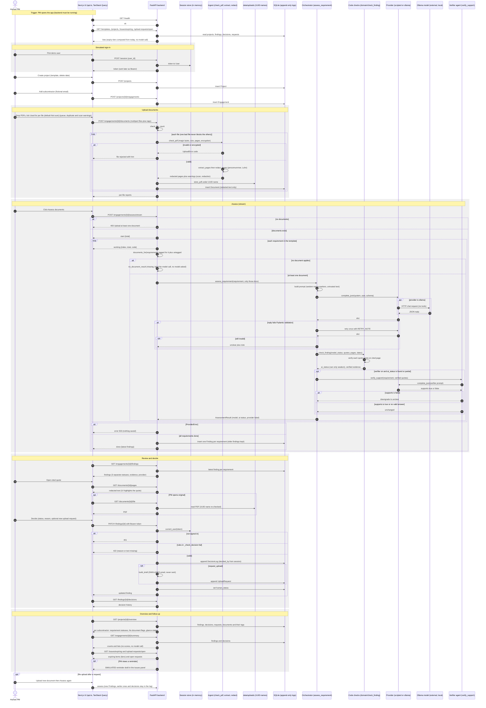

```mermaid
sequenceDiagram
    autonumber
    actor PM as Human PM
    participant UI as Next.js UI (api.ts, TanStack Query)
    participant API as FastAPI backend
    participant Sess as Session store (in memory)
    participant Ing as Ingest (check_pdf, extract, redact)
    participant Disk as data/uploads (UUID names)
    participant DB as SQLite (append-only logs)
    participant Orch as Orchestrator (assess_requirement)
    participant Dom as Code checks (domain/check_finding)
    participant Prov as Provider (scripted or ollama)
    participant LLM as Ollama model (external, local)
    participant Ver as Verifier agent (verify_support)

    Note over PM,UI: Trigger: PM opens the app (backend must be running)
    UI->>API: GET /health
    API-->>UI: ok
    UI->>API: GET /templates, /projects, /issues/expiring, /upload-requests/open
    API->>DB: read projects, findings, decisions, requests
    API-->>UI: lists (expiry tiers computed from today, no model call)

    rect rgb(240, 240, 240)
    Note over PM,Sess: Simulated sign-in
    PM->>UI: Pick demo user
    UI->>API: POST /session {user_id}
    API->>Sess: token to User
    API-->>UI: token (sent later as Bearer)
    end

    PM->>UI: Create project (template, delete date)
    UI->>API: POST /projects
    API->>DB: insert Project
    PM->>UI: Add subcontractor (fictional email)
    UI->>API: POST /projects/{id}/engagements
    API->>DB: insert Engagement

    rect rgb(240, 240, 240)
    Note over PM,DB: Upload documents
    PM->>UI: Drop PDFs, tick Used for per file (default Not sure) (queue, duplicate and scan warnings)
    UI->>API: POST /engagements/{id}/documents (multipart files plus tags)
    API->>API: check_file_count
    loop each file (one bad file never blocks the others)
        API->>Ing: check_pdf (magic bytes, size, pages, encryption)
        alt invalid or encrypted
            Ing-->>API: UploadError code
            API-->>UI: file rejected with hint
        else valid
            Ing->>Ing: extract_pages then redact_pages (personnummer, Luhn)
            Ing-->>API: redacted pages plus warnings (scan, redaction)
            API->>Disk: store_pdf under UUID name
            API->>DB: insert Document (redacted text only)
        end
    end
    API-->>UI: per-file reports
    end

    rect rgb(240, 240, 240)
    Note over PM,Ver: Assess (stream)
    PM->>UI: Click Assess documents
    UI->>API: POST /engagements/{id}/assess/stream
    alt no documents
        API-->>UI: 400 Upload at least one document
    else documents exist
        API-->>UI: start {total}
        loop each requirement in the template
            API-->>UI: working {index, total, code}
            API->>API: documents_for(requirement): tagged for it plus untagged
            alt no document applies
                API->>API: no_document_result (missing, label No model call, no model asked)
            else at least one document
            API->>Orch: assess_requirement(requirement, only those docs)
            Orch->>Orch: build prompt (random nonce markers, untrusted text)
            Orch->>Prov: complete_json(system, user, schema)
            opt provider is ollama
                Prov->>LLM: HTTP chat request (no tools)
                LLM-->>Prov: JSON reply
            end
            Prov-->>Orch: dict
            alt reply fails Pydantic validation
                Orch->>Prov: retry once with RETRY_NOTE
                Prov-->>Orch: dict
                opt still invalid
                    Orch-->>API: unclear plus note
                end
            end
            Orch->>Dom: check_finding(model_status, quotes, pages, dates)
            Dom->>Dom: verify each quote exists on cited page
            Dom-->>Orch: ai_status (can only weaken), verified evidence
            opt verifier on and ai_status is found or partial
                Orch->>Ver: verify_support(requirement, verified quotes)
                Ver->>Prov: complete_json(verifier prompt)
                Prov-->>Ver: supports true or false
                alt supports is false
                    Ver-->>Orch: downgrade to unclear
                else supports is true or no valid answer
                    Ver-->>Orch: unchanged
                end
            end
            Orch-->>API: AssessmentResult (model, ai status, provider label)
            end
        end
        alt ProviderError
            API-->>UI: error 503 (nothing saved)
        else all requirements done
            API->>DB: insert one Finding per requirement (older findings kept)
            API-->>UI: done {latest findings}
        end
    end
    end

    rect rgb(240, 240, 240)
    Note over PM,DB: Review and decide
    UI->>API: GET /engagements/{id}/findings
    API->>DB: latest finding per requirement
    API-->>UI: findings (3 separate statuses, evidence, provider)
    PM->>UI: Open cited quote
    UI->>API: GET /documents/{id}/pages
    API-->>UI: redacted text (UI highlights the quote)
    opt PM opens original
        UI->>API: GET /documents/{id}/file
        API->>Disk: read PDF (UUID name re-checked)
        API-->>UI: PDF
    end
    PM->>UI: Decide (status, reason, optional new upload request)
    UI->>API: PATCH /findings/{id} with Bearer token
    API->>Sess: current_user(token)
    alt not signed in
        API-->>UI: 401
    else rules in _check_decision fail
        API-->>UI: 422 (reason or text missing)
    else valid
        API->>DB: append DecisionLog (decided_by from session)
        opt request_upload
            API->>API: build_draft (SIMULATED email, never sent)
            API->>DB: append UploadRequest
        end
        API->>DB: set human_status
        API-->>UI: updated finding
    end
    UI->>API: GET /findings/{id}/decisions
    API-->>UI: decision history
    end

    rect rgb(240, 240, 240)
    Note over PM,DB: Overview and follow-up
    UI->>API: GET /projects/{id}/overview
    API->>DB: findings, decisions, requests, documents and their tags
    API-->>UI: per subcontractor: requirement statuses, No document flags, glance state
    UI->>API: GET /engagements/{id}/summary
    API->>DB: findings and decisions
    API-->>UI: counts and lists (no scores, no model call)
    UI->>API: GET /issues/expiring and /upload-requests/open
    API-->>UI: expiring items (tiers) and open requests
    opt PM views a reminder
        API-->>UI: SIMULATED reminder draft in the Issues panel
    end
    end

    opt Re-upload after a request
        PM->>UI: Upload new document then Assess again
        UI->>API: assess (new Findings, earlier ones and decisions stay in the log)
    end
```
