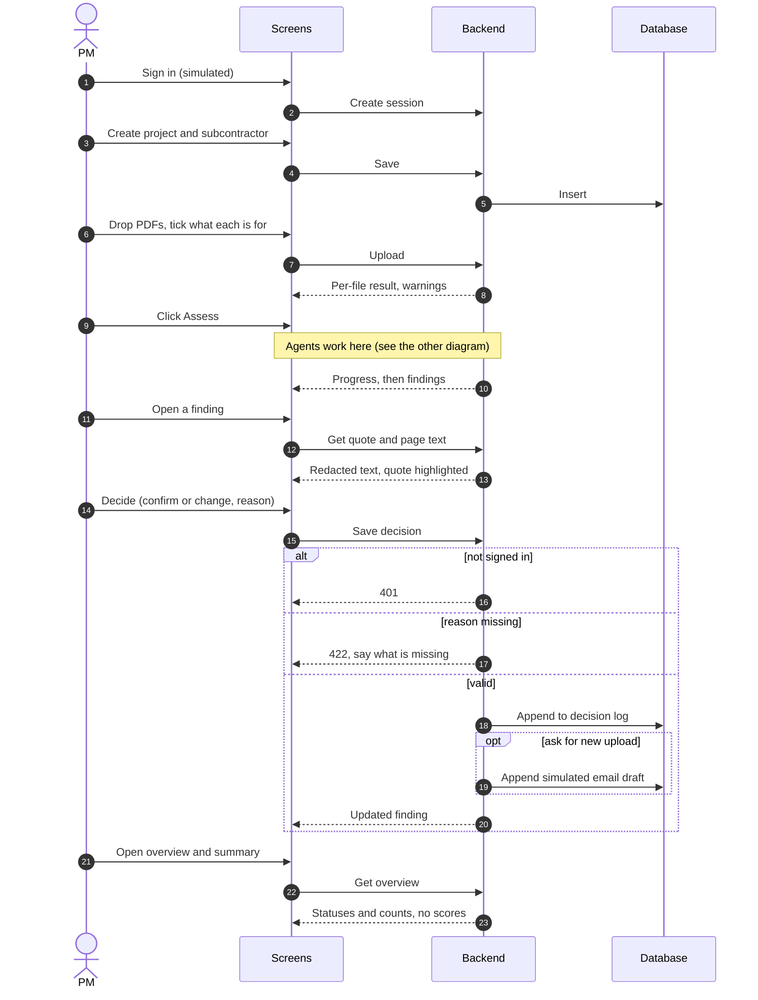

```mermaid
sequenceDiagram
    autonumber
    actor PM as PM
    participant UI as Screens
    participant API as Backend
    participant DB as Database
    PM->>UI: Sign in (simulated)
    UI->>API: Create session
    PM->>UI: Create project and subcontractor
    UI->>API: Save
    API->>DB: Insert
    PM->>UI: Drop PDFs, tick what each is for
    UI->>API: Upload
    API-->>UI: Per-file result, warnings
    PM->>UI: Click Assess
    Note over UI,API: Agents work here (see the other diagram)
    API-->>UI: Progress, then findings
    PM->>UI: Open a finding
    UI->>API: Get quote and page text
    API-->>UI: Redacted text, quote highlighted
    PM->>UI: Decide (confirm or change, reason)
    UI->>API: Save decision
    alt not signed in
        API-->>UI: 401
    else reason missing
        API-->>UI: 422, say what is missing
    else valid
        API->>DB: Append to decision log
        opt ask for new upload
            API->>DB: Append simulated email draft
        end
        API-->>UI: Updated finding
    end
    PM->>UI: Open overview and summary
    UI->>API: Get overview
    API-->>UI: Statuses and counts, no scores
```
